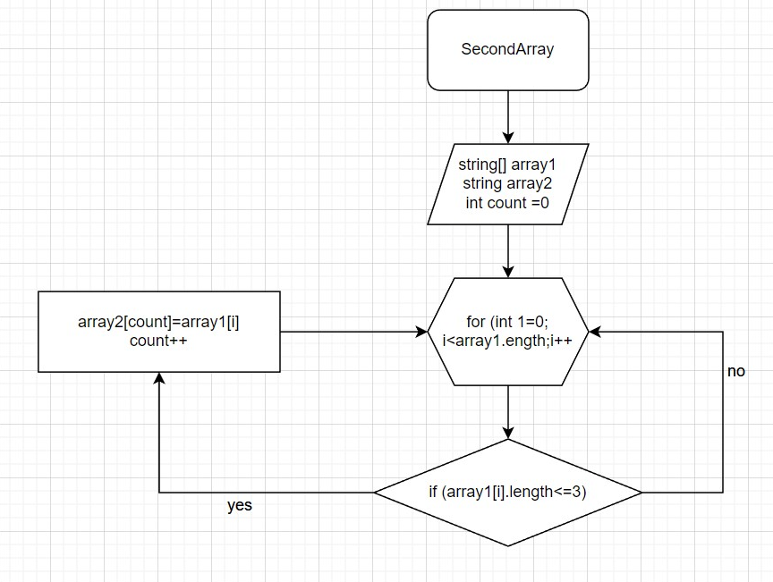

1. Показываем два массива

2. Используем метод,в котором цикл соизмерим длине массива,с условием проверки цикла( <=3 ), если "Yes" элемент массива 1 заносится в "count" элемента массива 2. Переменная "count" увеличивается на 1 и возращается к циклу "for" в котором "i" увеличивается на 1.

